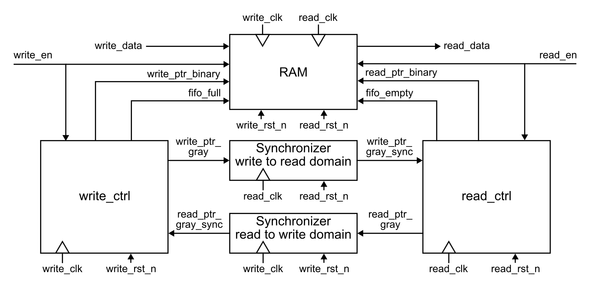

# Asynchronous_FIFO

## Top-Level Block Diagram

## Waveform

## Reference
1. [深入理解FIFO以及同步FIFO和异步FIFO的verilog实现代码](https://blog.csdn.net/yan1111112/article/details/117016688)
2. [FIFO设计-异步FIFO篇](https://zhuanlan.zhihu.com/p/464417028)
3. [面试必杀技：异步FIFO（上） -- CDC的那些事（5）](https://zhuanlan.zhihu.com/p/148175468)